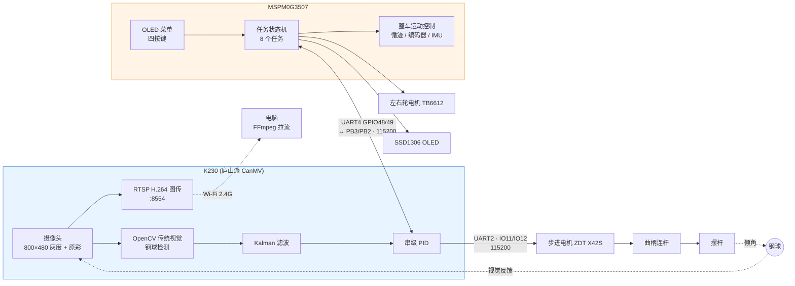

# 车载平衡滚球运动控制系统

> A vehicle-mounted ball-balancing system for the 2026 China Undergraduate Electronic Design Contest (Problem H).
> A K230 handles OpenCV-based steel-ball detection and cascade control (Kalman + PID) of a beam driven by a stepper motor through a crank-linkage, while an MSPM0G3507 runs the vehicle, the menu/OLED UI and the task handshake.
> Software only — no schematics, no mechanical drawings.

---

## 1. 项目简介

这是一套**车载平衡滚球运动控制系统**的软件部分。小车在赛道上行驶的同时，需要把一颗钢球稳定控制在摆杆的指定位置上。

系统由两块主控分工协作：

| 主控 | 职责 |
|---|---|
| **K230**（立创·庐山派 CanMV） | OpenCV 传统视觉识别钢球位置 → Kalman 滤波 → 串级 PID → 通过 UART2 驱动步进电机（ZDT X42S），经曲柄连杆机构控制摆杆倾角。同时自建 Wi-Fi 热点做 RTSP H.264 无线图传 |
| **MSPM0G3507**（TI） | 整车运动控制（循迹 + 编码器 + IMU）、OLED 菜单与按键交互、与 K230 的任务握手。K230 是它的"视觉协处理器" |

> ⚠️ **本仓库仅包含软件部分。** 没有原理图、PCB、机械结构图和 BOM。

### 已知的硬件型号（均可在源码中查到）

| 部件 | 型号 | 出处 |
|---|---|---|
| 视觉主控 | 立创·庐山派 K230-CanMV | `k230/main.py:1` |
| 整车主控 | TI MSPM0G3507，LQFP-64(PM) | `mspm0g3507/empty.syscfg:5` |
| 步进电机驱动器 | ZDT X42S（Emm FD 模式） | `k230/main.py:2978` |
| 直流电机驱动 | TB6612 | `mspm0g3507/Driver/Hardware/motor.c:3` |
| IMU | BMI088 | `mspm0g3507/Driver/PeripheralTest/gyro_bmi088.h:3` |
| 磁力计 | MMC5983MA | `mspm0g3507/Driver/Hardware/mmc5983ma.h` |
| 显示屏 | SSD1306 OLED，128×64，I²C 地址 0x3C | `mspm0g3507/Driver/Hardware/oled.c:3,20` |
| K230 Wi-Fi | RTL8189FTV（板载） | `k230/main.py:91` |

其余硬件信息（摆杆长度、轨道尺寸、钢球直径、供电方案等）代码中无法确定 —— 见 [docs/wiring.md](docs/wiring.md)。

---

## 2. 系统架构



**一句话说明控制回路**：K230 看到球在哪 → 算出该把摆杆倾多少 → 转成步进电机脉冲数 → 曲柄连杆推动摆杆 → 球滚动 → 摄像头再看到。MSPM0 则决定"什么时候开始跑、跑到哪、什么时候停"，两者靠一条 115200 的串口互相通报状态。

---

## 3. 目录结构

```
.
├── k230/
│   └── main.py              # K230 全部代码，单文件 5500+ 行
├── mspm0g3507/              # CCS 工程，可直接导入
│   ├── empty.c              # 应用入口，8 任务表 + 主循环
│   ├── empty.syscfg         # SysConfig 配置（引脚/外设/时钟的唯一来源）
│   ├── interrupt.c/.h       # 中断入口
│   ├── Driver/
│   │   ├── Control/         # 任务状态机、K230 通信、循迹、PID
│   │   ├── Hardware/        # 电机、编码器、OLED、IMU、蓝牙等驱动
│   │   └── PeripheralTest/  # 外设联调与调参程序（部分不参与编译）
│   ├── targetConfigs/       # CCS 调试探针配置
│   ├── speed_pid_tuner.py   # 串口在线 PID 调参上位机
│   └── llm_pid_tuner_config.example.json
├── docs/
│   ├── wiring.md            # 接线表
│   ├── protocol.md          # 通信协议（逐帧）
│   └── TODO.md              # 待办与已知问题
└── images/                  # 实物照片（待补充）
```

---

## 4. K230 端

### 4.1 部署方法

K230 上**只有 `k230/main.py` 一个文件**，不依赖本仓库的其它内容。

**方法一：CanMV IDE（推荐首次使用）**

1. 用 USB 线连接庐山派，打开 CanMV IDE 并连接。
2. 打开 `k230/main.py`，点击运行按钮即可直接执行。

**方法二：开机自启**

把文件复制到开发板存储卡根目录并命名为 `main.py`，上电后自动运行：

```bash
# 通过 CanMV IDE 的文件管理器，或 MTP/串口工具
# 把 k230/main.py 放到 /sdcard/main.py
```

> 注意：K230 上的 MicroPython 无法在电脑上运行（依赖 `media.sensor`、`media.display` 等板级模块）。本仓库只保证 `python -m py_compile k230/main.py` 语法通过。

### 4.2 ⚠️ 使用前必须修改热点配置

`k230/main.py` 里的 Wi-Fi 热点名和密码是**占位符**，使用前必须改成你自己的：

```python
K230_AP_SSID = "K230_AP"        # 改成你的热点名
K230_AP_PASSWORD = "CHANGE_ME"  # 改成你自己的密码，至少 8 位
```

**不改的话热点可能无法启动；即使能启动，同频段的人也能连上你的图传。** 密码小于 8 位时部分固件会拒绝创建热点。

### 4.3 两种运行模式

模式由**唯一的开关** `LINK_ENABLE` 决定（`k230/main.py:305`）：

| `LINK_ENABLE` | 模式 | 行为 |
|---|---|---|
| `True` | **比赛模式**（默认） | K230 上电后**什么都不做**，只等 MSPM0 通过 UART4 下发命令。所有任务由 MSPM0 的按键发起 |
| `False` | **单机调试模式** | 不接 MSPM0，K230 上电后自动运行 `K230_TEST_MODE` 指定的测试项 |

**单机调试模式下**，`K230_TEST_MODE` 可选 3 / 4 / 5 / 6（`k230/main.py:470`）：

| 值 | 测试内容 |
|---|---|
| `3` | O → +5 cm → −5 cm，最终保持在 −5 cm |
| `4` | 持续保持中心 O 点，模拟 A 到 B 行驶扰动 |
| `5` | 持续保持中心 O 点，模拟整圈行驶扰动 |
| `6` | 先等待钢球在任意位置稳定，再锁定该位置 |

> 源码注释里记录了一个踩过的坑：`LINK_ENABLE = True` 配着调试项一起用时，K230 会一直等一条永远不会来的命令，表现为"球和目标线都钉在 0 上不动"。**这两个开关是互斥的，只看 `LINK_ENABLE`。**

单机模式还有两个辅助开关：

- `STANDALONE_REPEAT`（默认 `False`）—— 跑完是否自动回中心重跑。`False` 表示跑一次就停在终点，符合题目"最后稳定在该位置"的要求。
- `WIRELESS_STREAM_ENABLE`（默认 `1`）—— 是否开启 Wi-Fi 热点与 RTSP 图传。

### 4.4 RTSP 无线图传

K230 自建 2.4 GHz 热点并用 H.264 编码推送画面，**不占用控制主循环**（采用非阻塞轮询）。

**步骤**

1. 电脑连接 K230 创建的热点（SSID 即 `K230_AP_SSID`）。
2. 程序启动时会打印实际 IP 和 URL，形如：

   ```
   [AP] RTSP address: rtsp://192.168.169.1:8554/live
   ```

3. 用 FFmpeg 拉流播放：

   ```bash
   # 直接播放（需要 ffplay）
   ffplay -fflags nobuffer -flags low_delay rtsp://192.168.169.1:8554/live

   # 一边预览一边录像
   ffmpeg -rtsp_transport tcp -i rtsp://192.168.169.1:8554/live \
          -c copy -f mp4 output.mp4
   ```

**URL 格式**：`rtsp://<K230的IP>:8554/live`

- 端口固定 **8554**（`RTSP_PORT`）
- 路径固定 **`live`**（`RTSP_SESSION`）
- **IP 不是写死的**，由程序读取 `ap.ifconfig()[0]` 得到并打印。庐山的 RTL8189FTV 固件通常为 `192.168.169.1`，但**请以启动时打印的实际值为准**。

**画面说明**：推流的是 800×480 原彩画面，**不包含** LCD/IDE 上绘制的检测框和文字。连接热点后无法上网是正常现象。

---

## 5. MSPM0G3507 端（CCS 工程）

### 5.1 环境要求

| 项 | 版本 |
|---|---|
| CCS | **CCS 20.3.1**（Theia 版） |
| 编译器 | **TI Arm Clang 4.0.4.LTS** |
| MSPM0 SDK | **2.08.00.03** |
| SysConfig | **1.25.0** |
| 目标器件 | MSPM0G3507，封装 LQFP-64(PM) |
| 运行模式 | NoRTOS，主循环 + 中断 |

> ⚠️ 仓库**不包含** TI MSPM0 SDK（driverlib），请自行安装。
> 工程通过 CCS 的路径变量引用 SDK，**不要手工填写绝对路径**：
> - `${COM_TI_MSPM0_SDK_INSTALL_DIR}` —— SDK 安装目录
> - `${COM_TI_MSPM0_SDK_INCLUDE_PATH}` / `${COM_TI_MSPM0_SDK_LIBRARY_PATH}` 等
> - `${PROJECT_ROOT}` —— 工程根目录
> - `${SYSCONFIG_TOOL_INCLUDE_PATH}` —— SysConfig 工具路径
>
> 这些变量由 CCS 在导入工程时按本机实际安装位置自动解析。

### 5.2 导入步骤

1. 安装 **CCS 20.3.1** 与 **MSPM0 SDK 2.08.00.03**（若 SDK 版本不同，SysConfig 会提示重新生成配置）。
2. 打开 CCS，菜单 **File → Import → CCS Projects**。
3. 选择 `mspm0g3507` 目录，勾选该工程，点击 **Finish**。
4. 工程名将显示为 **`mspm0g3507`**。

### 5.3 编译

1. 右键工程 → **Build Project**（或按 `Ctrl+B`）。
2. 首次编译时，CCS 会自动调用 SysConfig 根据 `empty.syscfg` 生成引脚/外设初始化代码到 `Debug/ti_msp_dl_config.c|.h`。
3. 编译产物在 `Debug/` 下，已在 `.gitignore` 中忽略。

> 📌 **SysConfig 生成文件不提交**：`Debug/ti_msp_dl_config.c` 和 `.h` 每次编译都会重新生成，因此不在仓库中。`empty.syscfg` 才是唯一配置来源，**不要手工修改生成出来的文件**。

### 5.4 烧录

1. 用 USB 线连接 LaunchPad 的调试口（板载 XDS110）。
2. 确认 `targetConfigs/MSPM0G3507.ccxml` 选中了 **Texas Instruments XDS110 USB Debug Probe**。
3. 菜单 **Run → Debug**（或按 `F11`）下载并进入调试。
4. 也可用 **Run → Load** 仅下载不调试。

### 5.5 按键操作

| 按键 | 引脚 | 功能 |
|---|---|---|
| K1 | PA12 | 下一个任务 |
| K2 | PB15 | 上一个任务 |
| K3 | PB14 | 执行当前任务（**在就绪提示下再按一次即为正式计时起点**） |
| K4 | PB13 | 取消 / 返回 |

### 5.6 八个任务

| # | 名称 | 说明 |
|---|---|---|
| 1 | `K230 VIDEO` | 图传 |
| 2 | `LAP STOP A` | 绕场行驶并在 A 点停车 |
| 3 | `BALL +5 TO -5` | 摆球控制在 +5 cm → −5 cm |
| 4 | `A TO B` | 从 A 行驶到 B，同时控球 |
| 5 | `LAP CENTER` | 绕圈行驶，保持球在中心 |
| 6 | `LAP TARGET` | 绕圈行驶，把球控到指定点 |
| 7 | `OTHER TEST` | 其他测试 |
| 8 | `LINE TUNE` | 循迹调参 |

对应赛题原文请见 `TODO(待补充)`。

---

## 6. 通信协议

K230 与 MSPM0 之间是一条 **115200 8N1** 的串口（K230 UART4 ↔ MSPM0 外设 UART3），所有帧都是 `[payload]` 形式的 ASCII 文本。

| 方向 | 主要帧 |
|---|---|
| MSPM0 → K230 | `[P3]`…`[P6]` 请求准备、`[G3]`…`[G6]` 正式开始、`[C6]` 回中心、`[S]` 停止、`[FC/FA/FE]` 起步前馈 |
| K230 → MSPM0 | `[±XXXX*]` 球位置（0.1 mm，30 ms 一帧）、`[R3]`…`[R6]` 就绪、`[RUN3]`…`[RUN6]` 运行中、`[D3]`…`[D6]` 完成、`[RETURN]`/`[IDLE]`/`[ERR,...]` |

完整帧表、字段单位、握手时序、超时重试参数以及**尚未确认的疑点**，见 **[docs/protocol.md](docs/protocol.md)**。

接线见 **[docs/wiring.md](docs/wiring.md)**。

---

## 7. 第三方代码与致谢

**本仓库不包含** TI 的 SDK 源码，仅通过 CCS 路径变量引用本机安装的 SDK。

| 内容 | 来源 | 说明 |
|---|---|---|
| MSPM0 SDK（driverlib）、CMSIS Core 头文件 | Texas Instruments | 需自行安装，仓库不分发 |
| `startup_mspm0g350x_ticlang.c` | TI MSPM0 SDK | 位于 SDK 安装目录，工程直接引用 |
| `Debug/ti_msp_dl_config.c/.h` | TI SysConfig 自动生成 | 每次编译重新生成，不提交 |
| `Driver/Hardware/oled_font.h` 的 `F6x8` 点阵字库 | **来源待确认** | 嵌入式领域广泛流传，代码中无版权声明 |

其余所有驱动（电机、编码器、OLED、IMU、磁力计、循迹、PID、K230 链路等）均为本项目自行编写。

感谢 TI 提供的 MSPM0 SDK 与 SysConfig 工具，以及立创·庐山派提供的 K230 CanMV 固件与文档。

---

## 8. 已知问题与待办

- **`docs/TODO.md`** 记录了所有已知问题：4 处指向不存在文件的悬空引用、被排除编译但保留的文件、协议中存疑的帧，以及**仅供参考、尚未执行**的重构建议。
- 本仓库只做了三件事：**脱敏、修正与代码不符的注释、补充文档**。**控制逻辑与算法一行未改。**

---

## 9. 许可证

[MIT License](LICENSE)

> 关于 `oled_font.h` 点阵字库的来源与许可，见 [docs/TODO.md](docs/TODO.md) §7。

---

## 10. 比赛信息

`TODO(待补充)` —— 请补充：

- 赛事全称与年份
- 赛区
- 所获奖项
- 题目全称

---

## 11. 免责声明

本项目为竞赛作品，**按原样提供，不保证可直接复现**。硬件平台、机械结构、标定参数均与实际参赛设备相关，直接套用到其它装置上需要重新标定。
